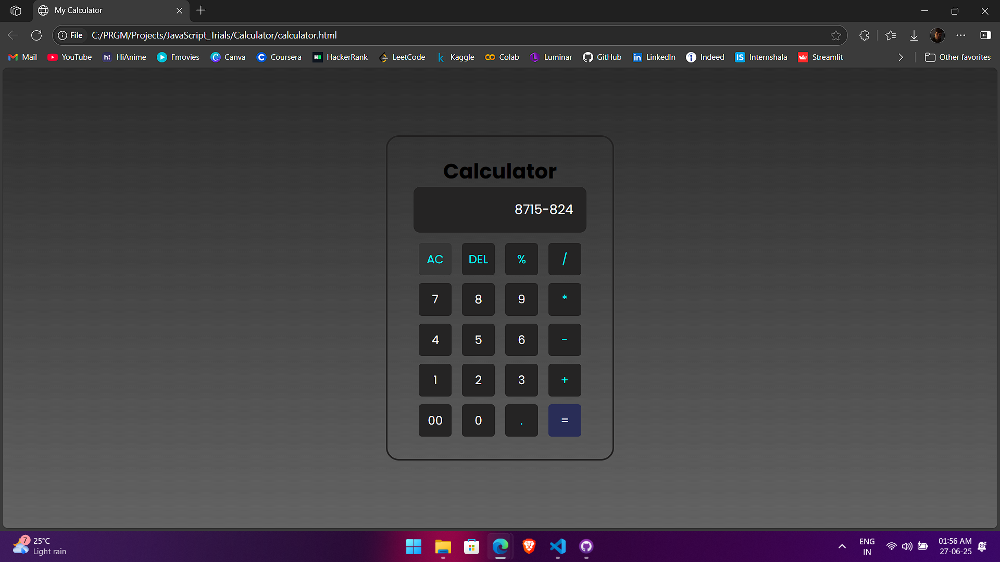
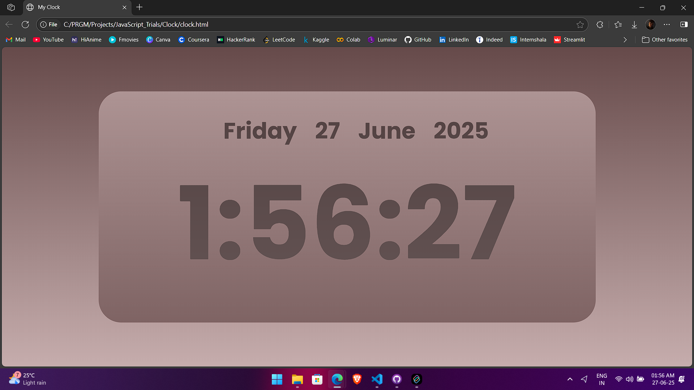

# 🧮 Calculator & ⏰ Digital Clock

Two simple web applications built using **HTML**, **CSS**, and **Vanilla JavaScript** — a basic calculator and a digital clock.

Created as part of a JavaScript project report to demonstrate core concepts like DOM manipulation and event handling.

---

## 📁 Projects Included

### 🧮 Calculator

A straightforward calculator for performing basic arithmetic operations using button-based input and dynamic expression evaluation.

- 

---

### ⏰ Digital Clock

A live digital clock that displays the current time and updates every second using JavaScript’s `Date` object and `setInterval()`.

- 

---

## 🛠 Tech Stack

- **HTML**
- **CSS**
- **JavaScript**

---
